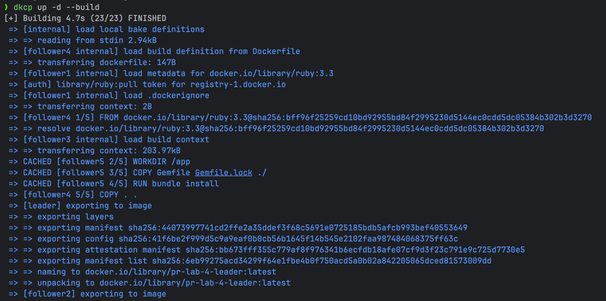
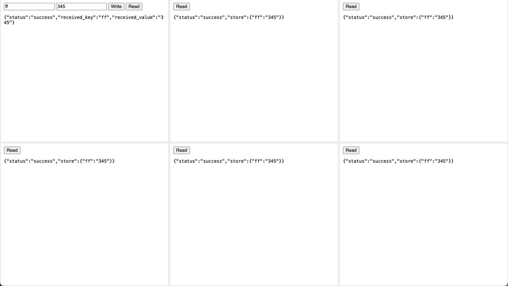
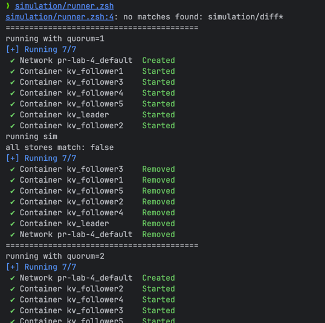
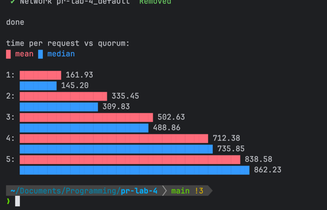
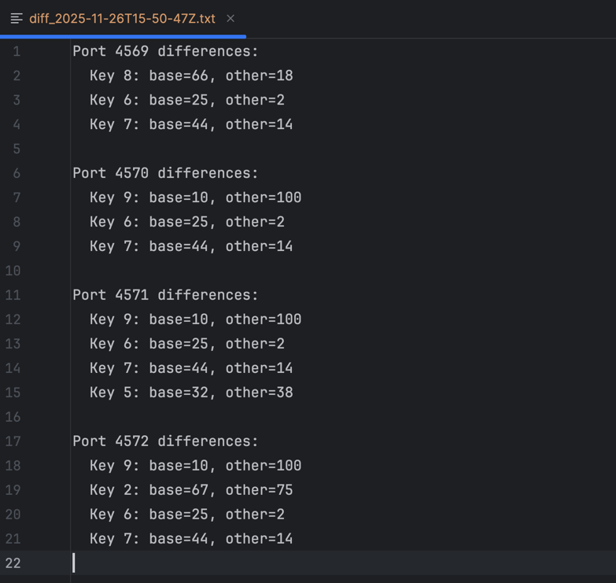

## Lab 4: Leader-Follower Concurrent Key-Value Store

### Course: PR

### Author: Rudenco Ivan

---
### Task
Implement a key-value store with single-leader replication (only the leader accepts writes, replicates them on all the followers). Both the leader and the followers should execute all requests concurrently. Run one leader and 5 followers in separate docker containers using docker-compose. Configure everything through environment variables inside the compose file. Use a web API and JSON for communication.

### Contents of the source directory

```
pr-lab-4
├── .bundle/
├── config/
│   └── puma.rb
├── kv_store/
│   ├── lib/
│   │   ├── request_controller.rb      # request handling logic
│   │   └── store.rb                   # kv store hash
│   ├── follower.rb                    # follower node
│   └── leader.rb                      # leader node
├── simulation/
│   ├── follower_store_checker.rb      # simulation helper
│   ├── latency_tester.rb              # simulation helper
│   └── runner.zsh                     # task runner for simulation
├── vendor/
├── webui/
│   └── index.html                     # ui to interact with the store
├── .env                               # environment variables
├── .gitignore
├── docker-compose.yaml
├── Dockerfile
├── Gemfile
├── Gemfile.lock
└── README.md
```

### Docker files
`Dockerfile`:
```
FROM ruby:3.3

WORKDIR /app

COPY Gemfile Gemfile.lock ./
RUN bundle install

COPY . .

# default
CMD ["irb"]
```

`docker-compose.yaml`:
```
services:
  leader:
    build: .
    container_name: kv_leader
    command: ["bundle", "exec", "ruby", "kv_store/leader.rb", "4567"]
    ports:
      - "4567:4567"
    env_file:
      - .env
    environment:
      FOLLOWERS: "http://follower1:4568,http://follower2:4569,http://follower3:4570,http://follower4:4571,http://follower5:4572"

  follower1:
    build: .
    container_name: kv_follower1
    command: ["bundle", "exec", "ruby", "kv_store/follower.rb", "4568"]
    ports:
      - "4568:4568"
    env_file:
      - .env

  follower2:
    build: .
    container_name: kv_follower2
    command: ["bundle", "exec", "ruby", "kv_store/follower.rb", "4569"]
    ports:
      - "4569:4569"
    env_file:
      - .env

  follower3:
    build: .
    container_name: kv_follower3
    command: [ "bundle", "exec", "ruby", "kv_store/follower.rb", "4570" ]
    ports:
      - "4570:4570"
    env_file:
      - .env

  follower4:
    build: .
    container_name: kv_follower4
    command: [ "bundle", "exec", "ruby", "kv_store/follower.rb", "4571" ]
    ports:
      - "4571:4571"
    env_file:
      - .env

  follower5:
    build: .
    container_name: kv_follower5
    command: [ "bundle", "exec", "ruby", "kv_store/follower.rb", "4572" ]
    ports:
      - "4572:4572"
    env_file:
      - .env

```

### Starting the store with Docker
Run `docker compose up -d --build`:



Leader will be accessible at `http://localhost:4567/`, and will accept `GET` requests at `/read`, and `PUT` requests at `/write`. Followers will be accessible at `localhost` with ports `4568` - `4572`, and will accept `GET` requests to `read`, as well as `PUT` requests to `replicate` from leader.

Each node of the store can be accessed using the web ui:



### Concurrent writes simulation

Prerequisites:
- run `pip install termgraph`
- a shell that can run `.zsh` scripts
- ruby version 3.0.0+
- run `chmod +x simulation/runner.zsh` to allow script execution

Running the simulation:
- run `simulation/runner.zsh`

This will start the docker containers 5 times with quorum values from `1` to `5` and have 10 clients concurrently make 10 write requests each:



When simulation finishes, it plots the values of average leader response times against quorum values:



In case when leader and follower stores have mismatch, a diff file will be generated, showing changes between leader and each client:



